# 🎨 UX Collection

> A curated collection of stunning wallpapers and custom macOS icons

This repository contains my personal collection of high-quality wallpapers and beautifully designed icons for macOS. All wallpapers are organized by resolution for easy browsing, and icons follow a consistent design language.

---

## 📁 Repository Structure

```
UX/
├── background/
│   ├── 2560x1440/     # QHD wallpapers
│   ├── 2800x1800/     # MacBook Pro Retina wallpapers
│   ├── 3440x1440/     # Ultrawide wallpapers
│   ├── 3840x2160/     # 4K UHD wallpapers
│   ├── 7680×4320/     # 8K wallpapers
│   └── other/         # Various resolutions
└── icons/             # Custom macOS application icons
```

---

## 🖼️ Featured Wallpapers

### Minimalist Mountains
*Clean, geometric mountain landscape in calming blue tones*

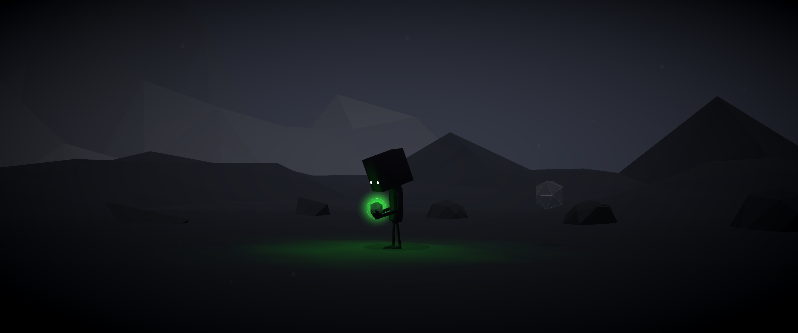

---

### Star Wars
*Epic Star Wars landscape scene*

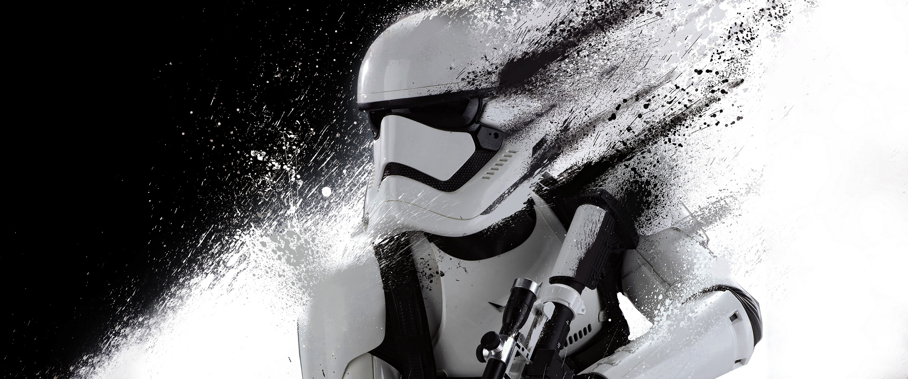

---

### Valley Serenity
*Peaceful white valley landscape*

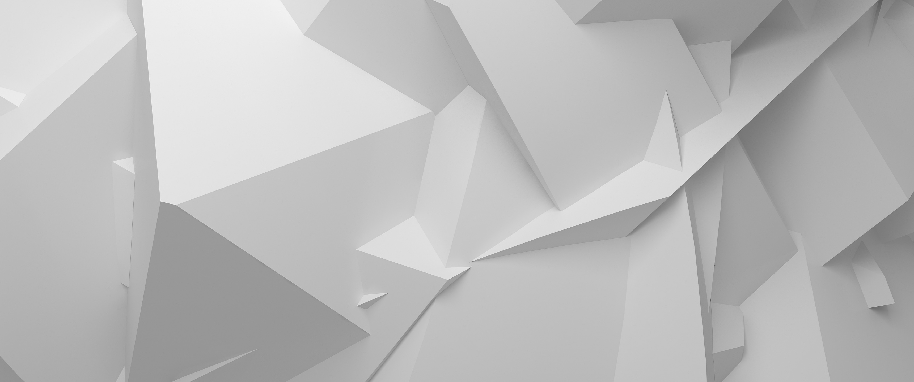

---

### Ghosts
*Atmospheric ghostly scene*


---

### Starlit Valley
*A beautiful starlit valley by Mikael Gustafsson*


---

### The Legend of Zelda: Breath of the Wild
*Link overlooking the breathtaking landscape of Hyrule*

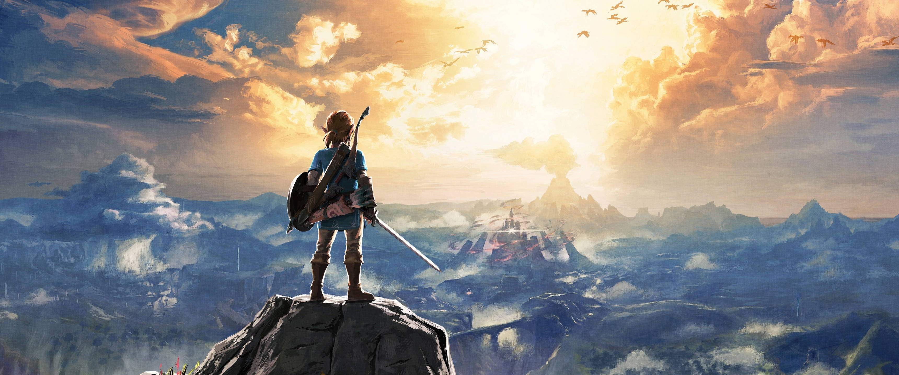

---

## 🎯 Custom Icons

Beautiful, cohesive icon designs for your favorite macOS applications.

<div align="center">

### System & Productivity
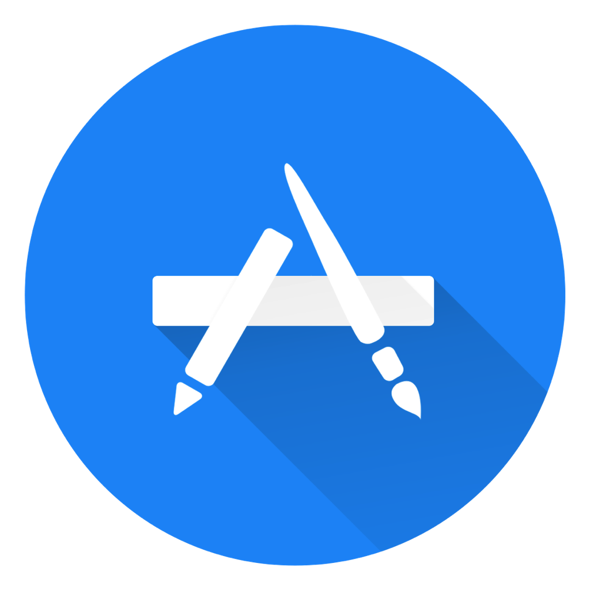
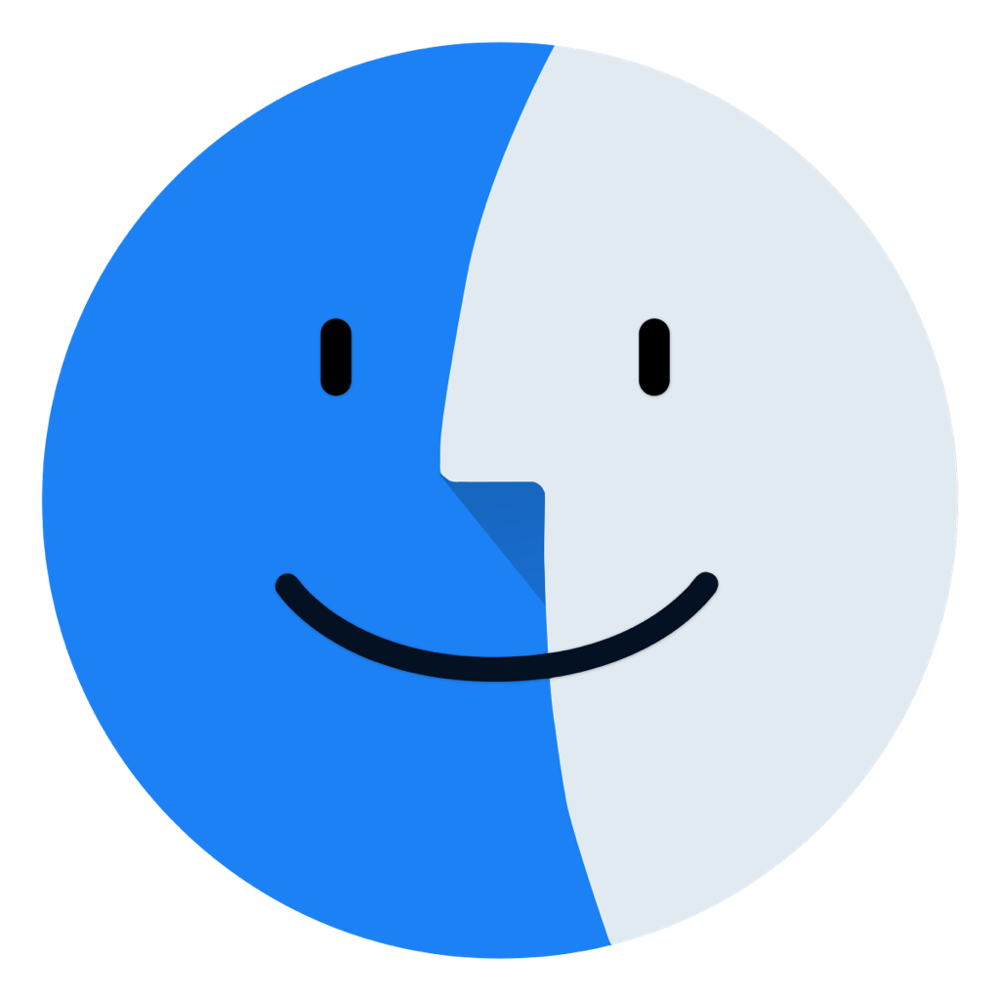

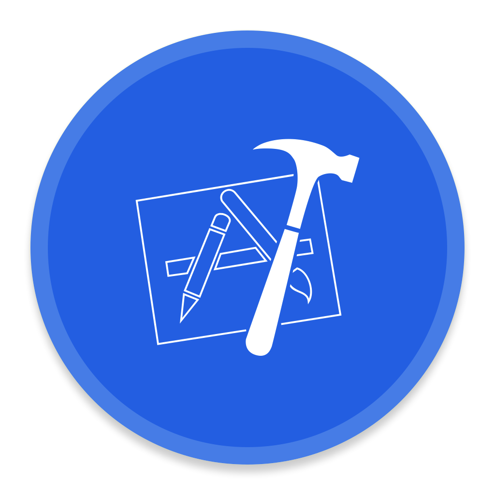

### Media & Communication


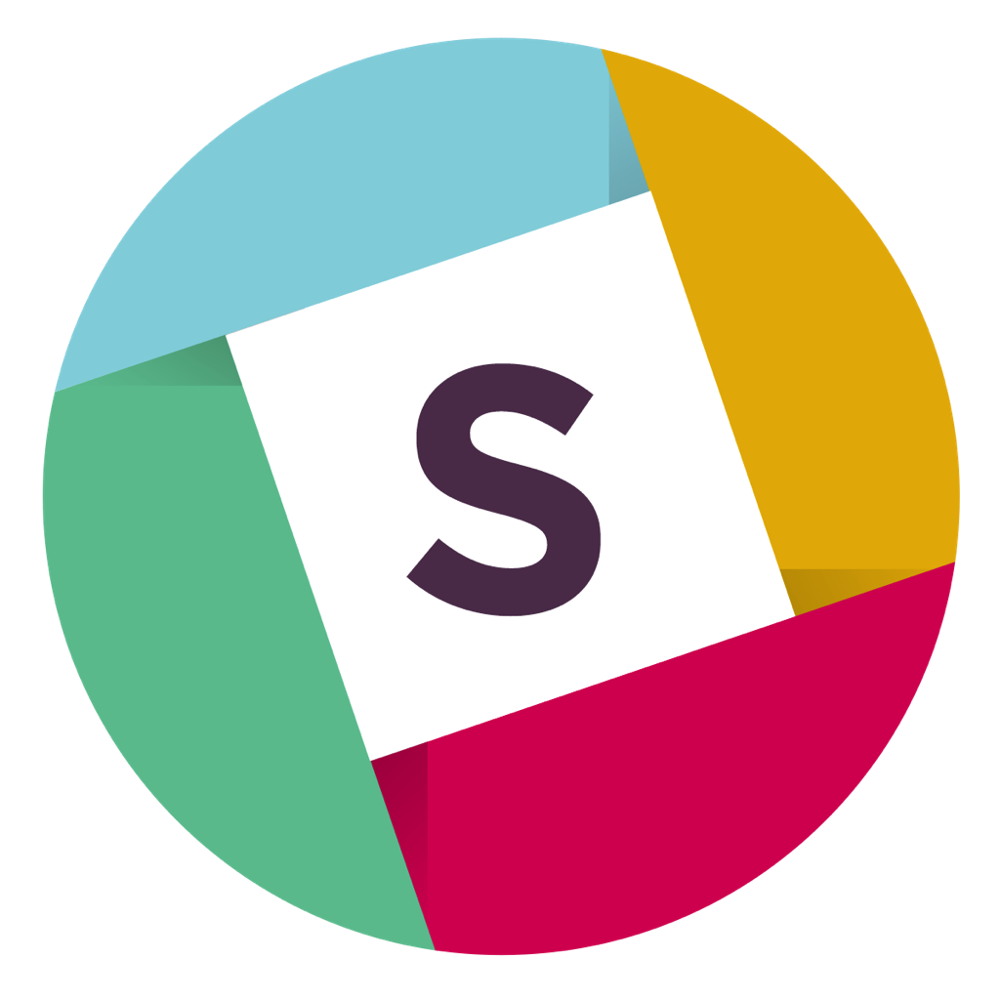


### Tools & Utilities

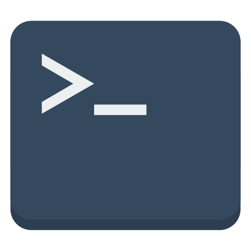
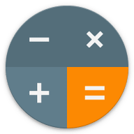
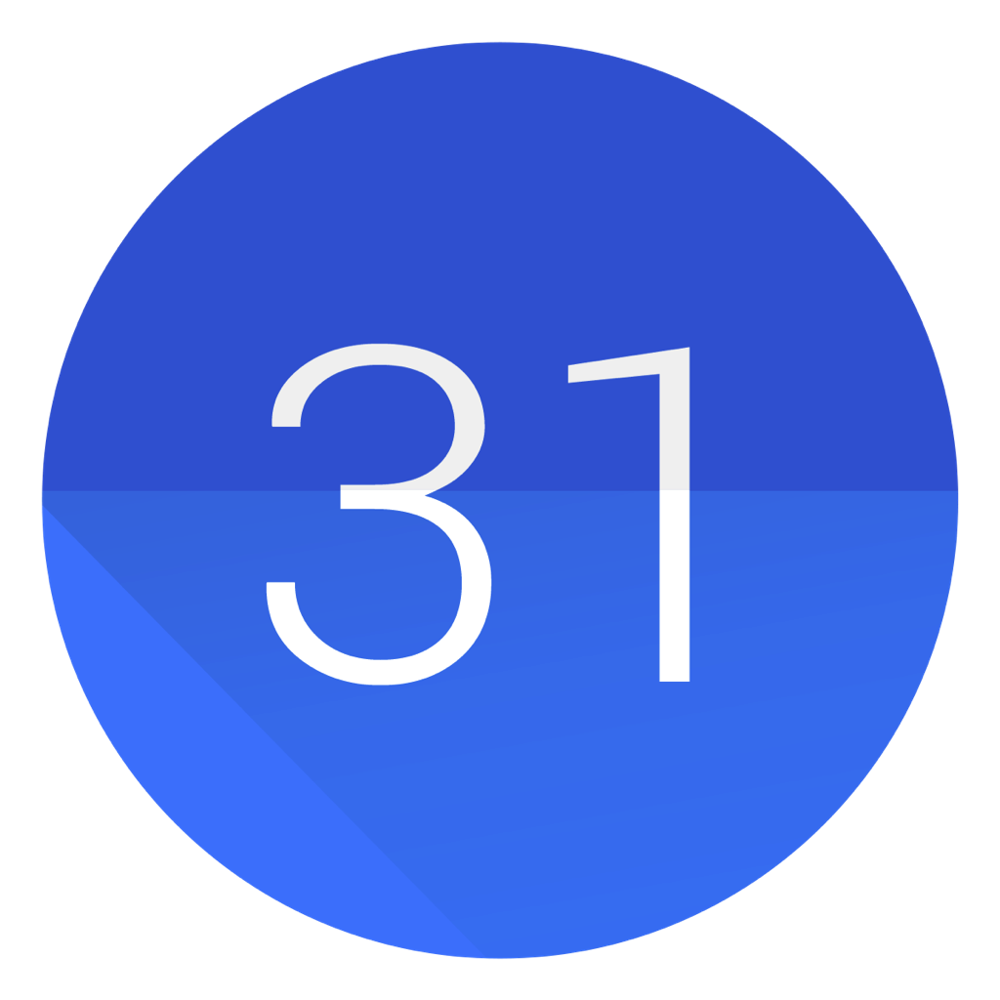

</div>

---

## 📥 Installation

### Wallpapers
1. Browse the `background/` directory for your desired resolution
2. Download or clone the repository
3. Set as wallpaper via System Preferences → Desktop & Screen Saver

### Icons
1. Find your desired icon in the `icons/` directory
2. Right-click the application in Finder → Get Info
3. Drag the icon file onto the small icon in the top-left corner of the Info window

---

## 🏷️ Categories

### Wallpaper Themes
- 🌌 **Space & Astronomy**: Galaxies, nebulae, and cosmic landscapes
- 🏔️ **Nature**: Mountains, forests, oceans, and natural wonders
- 🎨 **Abstract**: Geometric patterns, gradients, and artistic designs
- 🎮 **Gaming**: Star Wars, Zelda, and other gaming-inspired art
- 🌃 **Urban**: City skylines and architectural photography

### Icon Styles
- **Minimalist**: Clean, modern designs
- **Consistent**: Cohesive color palette and design language
- **High-Quality**: Retina-ready resolution

---

## 📊 Collection Stats

- **Total Wallpapers**: 160+
- **Resolutions**: 2560x1440, 2800x1800, 3440x1440, 3840x2160, 7680×4320
- **Total Icons**: 80+
- **File Formats**: PNG, JPG, ICNS

---

## 🤝 Contributing

Found an amazing wallpaper or icon? Feel free to submit a pull request! Please ensure:
- Wallpapers are high-quality (minimum 1920x1080)
- Icons maintain the repository's design consistency
- Files follow the naming convention: `{subject}-{style}-{variant}.{ext}`

---

## 📝 License

This is a personal collection. Please respect original creators' copyrights and usage terms.

---

<div align="center">

**Made with ❤️ for beautiful desktops**

[⬆ Back to Top](#-ux-collection)

</div>
